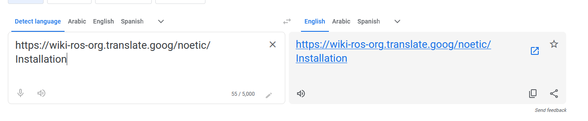

# Robotics-Project-Initalization-CUFE-25
this repo containing tutorials, initialization setup to environment and everythin to start  work on project

## Installation Guid

it will start from downloading ubuntu-20.04 till playing with with turtlebot3
burger [INSTALLATION](./INSTALLATION.md)

## Tutorials on  ROS

[ ROS دردشة ](https://www.youtube.com/watch?v=Rg9HuI6c_Q8) by  ENG. 
Mostafa Wael

[ How to create and launch a ROS project on the Constructor](https://www.youtube.com/watch?v=ZE8W6SQcLc4&t=0s)

[ROS Tutorials - ROS Noetic For Beginners](https://www.youtube.com/playlist?list=PLLSegLrePWgIbIrA4iehUQ-impvIXdd9Q) lack som basics (launch  files - node parameters - etc)

[ 10 things you need to know about ROS! | Getting Ready to Build Robots with ROS #4 ](https://www.youtube.com/watch?v=KAASuA3_4eg&list=PLunhqkrRNRhYYCaSTVP-qJnyUPkTxJnBt&index=4) cover lost topics in playlist above but work with ros2

[ ros gazebo maze simulation for turtlebot3 (beginner-level tutorial) ](https://www.youtube.com/watch?v=J_vasKVhUQM) create your own map and spwan launch file of turtlebot3

[ The ROS Transform System (TF) | Getting Ready to Build Robots with ROS #6 ](https://www.youtube.com/watch?v=QyvHhY4Y_Y8&list=PLunhqkrRNRhYYCaSTVP-qJnyUPkTxJnBt&index=6) I think we will need it

[ How do we describe a robot? With URDF! | Getting Ready to build Robots with ROS #7 ](https://www.youtube.com/watch?v=CwdbsvcpOHM&list=PLunhqkrRNRhYYCaSTVP-qJnyUPkTxJnBt&index=7) I dont know if we will need it 🤔

[ Simulating Robots with Gazebo and ROS | Getting Ready to Build Robots with ROS #8 ](https://www.youtube.com/watch?v=laWn7_cj434&list=PLunhqkrRNRhYYCaSTVP-qJnyUPkTxJnBt&index=8)

## Tutorials on Material

## Packages you will need

1. gmapping (for mapping in SLAM) (**Take Care :** work best for long laser radars and bad for short ones
2. explore_light (for creating map autonomously ) (launch it after launching gmapping)
3. acml (for navigation to the goal from initial position)

## Tips

### using Translate instead of VPN
I don't why but *wiki.ros.org* work poorly and slow. I found that translating it to english 3ady and then follow link will be faster
 
